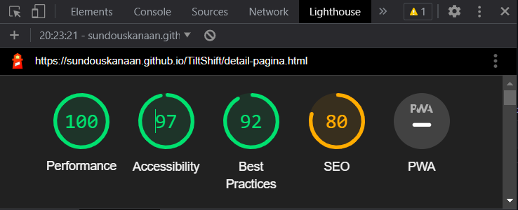
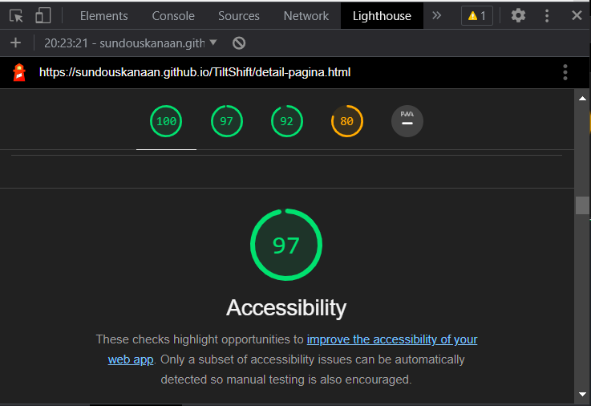

# TiltShift
Hier beschrijven wij onze keuzes op basis van onze kennis op development gebied.

# Semantisch correcte code
We hebben ervoor gekozen om semantisch correcte code te schrijven, zodat het niet alleen
voor ons overzichtelijk is maar ook makkelijk is over te dragen aan andere techneuten. 
Denk hierbij aan een header, main en footer. Door deze elementen apart te groeperen 
creëert het toch overzicht. 

# Header
De header is voorzien van een navigatiebalk die het mogelijk maakt om door de gehele
website te kunnen navigeren. 

# Algemeen
### **Sundous**:

### CSS file
Ik heb in de het begin van de CSS file commentaren gemaakt voor snelle toegang tot het beoogde onderdeel, daar bij de zoeken naar hetzelfde commentaar komt de programmeur naar de juiste stuk code.

Waarom heb ik dat gedaan?

Omdat de CSS file te lang is en dat het ingewikkeld maakt om snel naar de juiste stuk te komen.

### JSON

Ik heb een JSON file gemaakt met de belangrijkeste informatie in het overzichtspagina en met AJAX in de JavaScript heb ik mijn twee viewen gebouwd. 

### JavaScript
Ik heb een JavaScript file voor elke pagina gemaakt om geen errors te hebben als elementen in een pagina staan en niet in de andere en een JavaScript file voor de AJAX code, want hij is te ingewikkeld.

Ik heb een localStorage gebruikt in de AJAX code om het view, de thema filter en de organisatie filter resultaten te onthouden, als we naar de detailspagina gegaan hebben en nog een keer terug gekomen naar de overzichtspagina.

# Overzichtspagina

### **Sundous**:

Daar hebben we twee soorten van viewen table en lijst van bloken. 

Ik heb in de code twee functions gemaakt voor elke view, want we hebben verschillende aantal elementen per view, verschillende html elementen en css stylen. Dus heb ik een function gemaakt die heet "switchview" om te checken welke view heb ik nu op het pagina volgens de view icon en volgens dit gaat de function "getalgoritmes(index)" werken om de juiste bouwen function te verwerken.

We hebben de blokken als standaard view dus heb ik met onload event in de Javascript dat aangepast. en volgens de Loop die maakt de elementen voor mij heb ik de pagination gemaakt en de resultaten stukje onder het pagina, want de loop moet mijn info van de JSON file halen en werken volgens de pagination buttons en de resutaten rekenen volgens de resultaten van de loop.

### Filters
Voor de filters heb ik een function heet "filterCity" gemaakt daar wordt de elementen filteren volgens de organistaties. er ook function "filterData" voor thema filteren en koppeld om samen te werken volgens de organitatie filter. De pagination en de elementen resultaten hebben relatie met de filters functions om de juiste values altijd te hebben.

Ik heb ook een function gemaakt heet "noItems" om duidelijk te vertelen dat er geen resultaten is . Dat beteken dat er geen algoritme info in de database volgens de filteren is.

### Chatbot
In de chatbot heb ik een description list <dl> voor de FAQ en met de JavaScript heb ik het geactiviert als een dropdown lijst met en dropdown vragen erin. Voor dat heb ik een Arrey gemaakt van de vragen elementen anders gaat de code alleen met de eerste element werken.

  
# Detailspagina
  
### **Sundous**:

### Tabs
Daar heb ik de tabs stuk gemaakt met buttons en divjes.

### Notification popup
Mijn teamgenoot heeft de notification popup gemaakt en heb ik hem aangepast en geactiveerd met css en JavaScript om zonder een email niet te werken, de value van de input terug komen in het bedankt bericht en de notificatie icon veranderen.

Om met hetzelfde popup veld werken heb ik via JavaScript de elementen in de popup div weggegooid en niewe elementen gemaakt in dit gevaal kan ik de input value halen en gebruiken altijd.

# Eindpunt

### **Sundous**:
Ik heb de accessibility gecheckt via mijn browser en daar heb ik  een result van 97%.
  
  - 
  - 
  
Helaas het detailspagina inhoud bestaat niet in de database van ons dus de detailspagina is een staandaard pagina, we wilden dat met JSON file en AJAX code bouwen, maar we haden geen genoeg tijd om dat te doen. Om alle data voor de 14 algoritmeregisters in de database te verzamelen kost dat te veel tijd, die we niet hebben.

  # TiltShift
Hier beschrijven wij onze keuzes op basis van onze kennis op development gebied.

# Semantisch correcte code
We hebben ervoor gekozen om semantisch correcte code te schrijven, zodat het niet alleen
voor ons overzichtelijk is maar ook makkelijk is over te dragen aan andere techneuten. 
Denk hierbij aan een header, main en footer. Door deze elementen apart te groeperen 
creëert het toch overzicht. 

# Header
De header is voorzien van een navigatiebalk die het mogelijk maakt om door de gehele
website te kunnen navigeren. 

# Main 
In de main is er voornamelijk gewerkt met sections met daarin een div. De section word gebruikt
als grote container om de elementen heen en in een div bevinden zich de kleinere elementen. Denk
bijvoorbeeld aan een section met daarin 2 divjes die ervoor zorgt dat de divjes in de section 
goed worden gepositioneerd. Niet voor elk element word een class gebruikt, zodat de code er 
nog wat overzichtellijker uitziet. 
